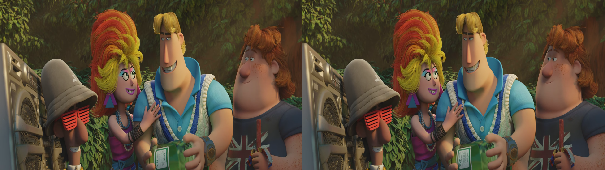
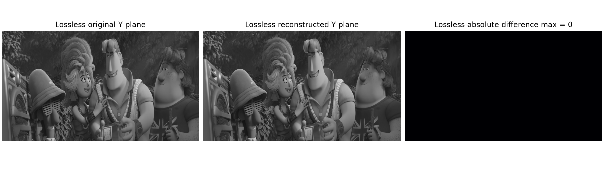
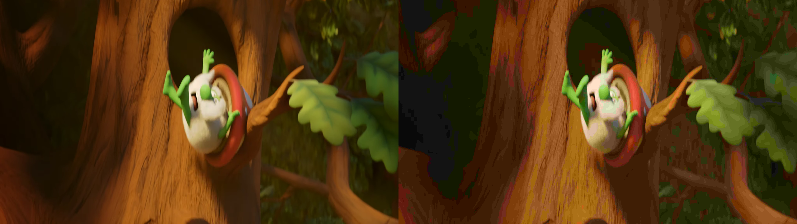
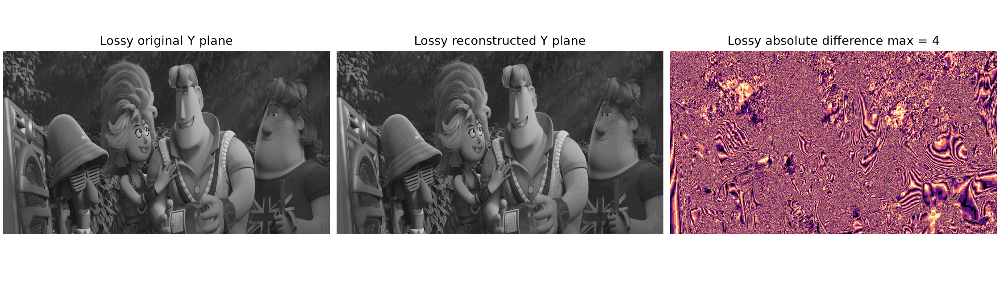
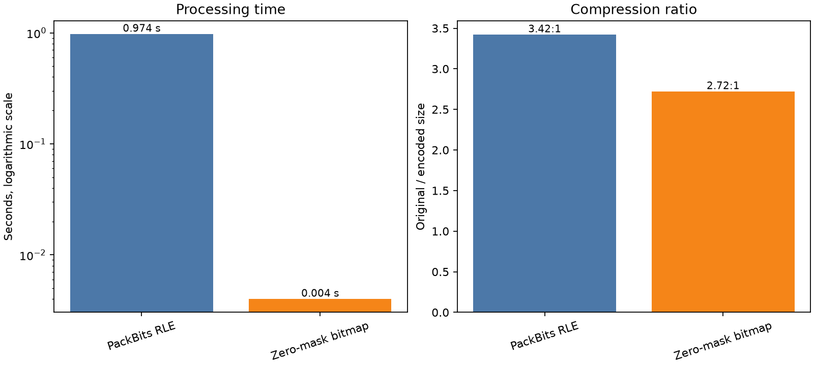
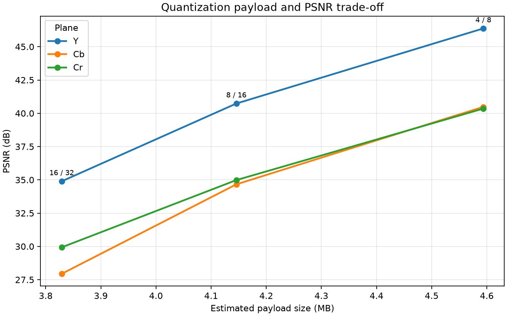

# Video Codec Project

**Course:** Multimedia-Kommunikation (AI1033)

**Term:** Summer Semester 2026

**Group:** Gruppe 4

**Members:** Thomas Krasel, Florian Ruppel, Luca Michael Schmidt, Roman Walter Sippel

This project implements a small educational video codec for `C420jpeg` Y4M files. It uses a custom binary container, periodic intra-coded frames, predicted frames, and self-written residual coding. No general-purpose compressor or external video codec is used by the pipeline.

## Running the project

Place the official input at `source.y4m` in the project root and run:

```bash
uv run main.py
```

The program creates `output/` automatically and writes:

- `lossless.bin`
- `lossless_reconstructed.y4m`
- `lossy.bin`
- `lossy_reconstructed.y4m`

Both reconstructed Y4M files can be opened in VLC. The implementation requires Python 3.14 and obtains NumPy and tqdm through `uv`.

## 1. Architecture

All integer fields use little-endian byte order. Text is ASCII and consists of a 32-bit byte count followed by that number of bytes.

### 1.1 File header

| Field              |     Size | Description                                                   |
| ------------------ | -------: | ------------------------------------------------------------- |
| Magic              |  4 bytes | `LS01` for lossless or `LY01` for lossy                       |
| Width              |  4 bytes | Luma width in samples                                         |
| Height             |  4 bytes | Luma height in samples                                        |
| FPS                | variable | Length-prefixed Y4M frame-rate text                           |
| Interlacing        | variable | Length-prefixed Y4M interlacing text                          |
| Aspect ratio       | variable | Length-prefixed Y4M aspect-ratio text                         |
| Chroma             | variable | Length-prefixed chroma identifier; only `420jpeg` is accepted |
| Frame count        |  4 bytes | Number of encoded frames                                      |
| GOP size           |  4 bytes | Distance between I-frames; currently 30 frames                |
| Quantization steps |  8 bytes | Lossy only: 32-bit Y step followed by 32-bit chroma step      |

The metadata is sufficient to restore a standards-compliant Y4M header. Unknown magic values, invalid dimensions, unsupported chroma layouts, malformed payload lengths, unexpected frame types, and trailing bytes are rejected by the decoder.

### 1.2 Frame organization and payload

Each Group of Pictures starts with an I-frame. At 30 fps and a GOP size of 30, every second begins with an independently decodable reference frame. All frames between two I-frames are P-frames predicted from the immediately preceding reconstructed frame.

```text
frame type (1 byte: 0 = I, 1 = P)
├── Y payload length (4 bytes)  + Y payload
├── Cb payload length (4 bytes) + Cb payload
└── Cr payload length (4 bytes) + Cr payload
```

Every plane payload begins with a one-byte coding method:

- `0` stores all residual bytes directly.
- `1` stores a one-bit non-zero mask for every residual sample, followed by only the non-zero bytes in raster order.

The encoder calculates both sizes and selects the smaller representation per plane. Therefore, the mask cannot enlarge a noisy plane. Plane dimensions are derived from the header, so sample counts do not need to be repeated in each frame.

## 2. Algorithms

### 2.1 Lossless mode

For an I-frame, each sample is predicted from its left neighbour. The first sample of each row is predicted from zero. The stored residual is

```text
residual = (current - prediction) modulo 256
```

This is spatial compression because smooth horizontal areas produce many zero residuals inside one image. The decoder restores a row using a cumulative sum modulo 256.

For a P-frame, the sample at the same position in the previous frame is the prediction. Unchanged image areas therefore become zero. The previous frame is always an already reconstructed reference, and unsigned modulo-256 arithmetic makes subtraction and addition exactly reversible. Periodic I-frames bound dependencies and allow decoding to recover at the next GOP after damaged data.

The residual is then encoded with the adaptive raw/zero-mask representation described above. This final stage is lossless and was implemented directly rather than delegated to `zlib`, `gzip`, FFmpeg, or another codec.





The lossless error map is completely black because the reconstructed Y plane has zero absolute difference from the original frame. The image is included as a visual check in addition to the byte-exact round-trip test.

### 2.2 Lossy mode

The input already uses YCbCr 4:2:0, so chroma has one quarter of the spatial resolution of luma. The lossy encoder additionally performs uniform scalar quantization:

```text
Y code     = round(Y / 8)
Cb/Cr code = round(Cb/Cr / 16)
```

The decoder multiplies these codes by their steps and clips the result to the byte range. Chroma receives the coarser step because human vision is generally more sensitive to luminance detail than to small colour differences. Quantization also makes neighbouring and consecutive samples more likely to share the same code, improving zero-mask compression.

Spatial and temporal prediction are then applied to the quantized codes exactly as in lossless mode. P-frames reference the previous quantized code planes, not the original input. Encoder and decoder therefore use identical references and do not accumulate quantization drift. This intentionally simple design uses no motion estimation, transform blocks, or B-frames.

## 3. Evaluation

The following measurements use the official 300-frame, 1280×720, 30 fps `source.y4m`. Compression ratio is defined as `original size / encoded size`; MB uses 1,000,000 bytes.

All benchmarks and performance evaluations were executed on an Apple Mac mini M4 (24 GB RAM) under macOS and Python 3.14 via `uv`. Processing times on other hardware configurations may vary accordingly.

### 3.1 Size comparison

| File / mode    | Size (bytes) | Size (MB) | Compression ratio | Size reduction |
| -------------- | -----------: | --------: | ----------------: | -------------: |
| `source.y4m`   |  414,721,883 |    414.72 |            1.00:1 |          0.00% |
| `lossless.bin` |  171,418,418 |    171.42 |            2.42:1 |         58.67% |
| `lossy.bin`    |  110,920,689 |    110.92 |            3.74:1 |         73.25% |

A streaming byte comparison confirmed that all 300 decoded lossless Y, Cb, and Cr planes exactly match the source. The reconstructed Y4M file is 35 bytes smaller only because the writer normalizes the Y4M header and omits optional source tags; its actual frame payload is identical.

The lossy reconstruction produced these objective sample-domain results:

| Plane |    MSE |     PSNR | Maximum absolute error |
| ----- | -----: | -------: | ---------------------: |
| Y     |  5.536 | 40.70 dB |                      4 |
| Cb    | 23.263 | 34.46 dB |                      8 |
| Cr    | 21.742 | 34.76 dB |                      8 |

These maximum errors follow directly from rounding to the nearest quantization level with steps 8 and 16. The experimental sweep and its design rationale are included in section 3.3 below, so the README stays understandable without an additional development document.

### 3.2 Visual artifact analysis



The original is shown on the left and the lossy reconstruction on the right. The most noticeable artifacts are posterization and colour banding in smooth gradients, especially in the tree and dark green background. Fine colour texture is simplified, and some coloured edges look harsher. These effects follow from the 16-value chroma quantization step combined with the source's existing 4:2:0 chroma subsampling. Luma retains more detail because its step is only 8.

Classical 8×8 blocking is not expected because this codec performs no block transform. Temporal ghosting is also limited: prediction changes representation and file size but does not discard additional temporal residuals. This trades compression efficiency for a simple, stable, and explainable I/P-frame pipeline.



The Lossy difference map shows the quantization error in the reconstructed Y plane. Unlike the lossless map, it contains visible values because the lossy mode intentionally changes samples to reduce the payload size.

### 3.3 Experimental Design Rationale & Benchmarks

The experiments were designed to compare the important implementation choices on the same data. The first 12 frames of the official 1280×720 Y4M source were used as a common sample. They contain 16,588,800 bytes of uncompressed Y, Cb, and Cr payload. For the residual-coding comparison, the first frame was stored without a temporal reference and later frames were subtracted from their predecessors at the same sample positions. Container metadata and length fields were excluded, so the comparison focuses on the residual representation itself. After the final design was selected, the complete 300-frame video was used for the authoritative size and quality measurements in section 3.1.

All benchmarks and performance evaluations were executed on an Apple Mac mini M4 (24 GB RAM) under macOS and Python 3.14 via `uv`. Processing times on other hardware configurations may vary accordingly.

#### PackBits-RLE versus zero-mask bitmap

The first candidate was a self-written PackBits-style run-length encoder. Runs of at least three equal bytes were stored using a control byte and the repeated value; other bytes were collected into literal blocks. This can represent repeated residual values other than zero, which is useful for repeated gradients or constant brightness changes.

The second candidate stored one bit per residual sample in a non-zero bitmap, followed by only the non-zero residual bytes in raster order. NumPy can create the mask and select the non-zero values in vectorized operations, so it does not need a slow Python-level sample loop.

| Residual method  |       Raw sample | Encoded payload | Compression ratio | Processing time |
| ---------------- | ---------------: | --------------: | ----------------: | --------------: |
| PackBits-RLE     | 16,588,800 bytes | 4,849,259 bytes |            3.42:1 |         0.974 s |
| Zero-mask bitmap | 16,588,800 bytes | 6,098,886 bytes |            2.72:1 |         0.004 s |

PackBits produced the smaller residual payload, but the byte-by-byte Python scanner needed almost one second for the 12-frame excerpt. The bitmap payload was about 25.8% larger, but its measured processing time was roughly 240 times lower and it is especially effective when temporal prediction produces many zero values. The final codec therefore uses the bitmap where it is smaller and falls back to raw residual bytes otherwise. The one-byte method field tells the decoder which representation was selected, so noisy I-frames are not enlarged by a fixed mask.



#### Quantization-step sweep

Three luma/chroma step pairs were tested for lossy mode. For each pair, the planes were rounded to the nearest quantization level, reconstructed, and evaluated with PSNR. The payload estimates use temporal prediction and the adaptive bitmap representation; container overhead is excluded from this small comparison.

| Y / chroma step | Estimated payload |   Y PSNR |  Cb PSNR |  Cr PSNR | Assessment                              |
| --------------: | ----------------: | -------: | -------: | -------: | --------------------------------------- |
|           4 / 8 |   4,593,578 bytes | 46.37 dB | 40.48 dB | 40.35 dB | High quality, but the payload is larger |
|          8 / 16 |   4,145,621 bytes | 40.73 dB | 34.66 dB | 34.98 dB | Balanced middle setting                 |
|         16 / 32 |   3,828,914 bytes | 34.89 dB | 27.94 dB | 29.93 dB | Strong posterization and colour loss    |

The 4/8 setting had the best objective quality, but its estimated payload was about 10.8% larger than the 8/16 result. The 16/32 setting saved only another 316,707 bytes, or about 7.6% in this sample, while luma PSNR dropped by nearly 6 dB and chroma PSNR reached only about 28–30 dB. Steps 8 for Y and 16 for Cb/Cr were therefore selected as the middle trade-off: luma stays above 40 dB PSNR while the coarser chroma step improves repeated-code compression without excessive visible colour contouring.



The experiments have limits. They use one early 12-frame excerpt, so videos with more noise, camera movement, or scene cuts may favour another residual representation. The adaptive raw fallback reduces this dependency but does not remove it. The final 300-frame measurements in section 3.1 remain the authoritative evaluation, while this section explains why the selected implementation was chosen.

## 4. Verification

The implementation was checked with synthetic round-trip tests across a GOP boundary, malformed payload tests, a complete run on the official source, byte-exact lossless payload hashing, and full-video lossy MSE/PSNR calculation. The benchmark alternatives and their measured trade-offs are documented in section 3.3, so no separate development directory is required to understand these results.
