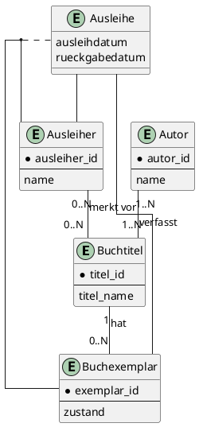
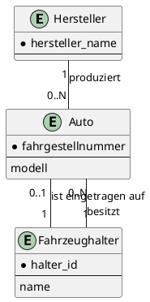
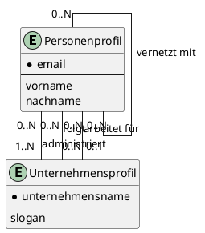
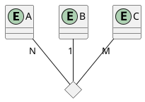

# Übungsblatt 2 – Hausaufgaben

Luca M. Schmidt

---

## Hausaufgabe 1

Für die nachfolgenden Sachverhalte werden Entity-Relationship-Diagramme erstellt, welche die Entitäten, Beziehungen, Funktionalitäten und Attribute modellieren.

### a) Altklausuraufgabe: Bibliothek

- **Entitäten:**
    - `Buchtitel` (PK: TitelID)
    - `Buchexemplar` (PK: ExemplarID)
    - `Ausleiher` (PK: AusleiherID)
    - `Autor` (PK: AutorID)
- **Beziehungen und Funktionalitäten:**
    - Ein `Buchtitel` kann mehrere `Buchexemplare` haben (1:N).
    - Ein `Ausleiher` kann mehrere `Buchexemplare` leihen und ein `Buchexemplar` kann von mehreren Ausleihern (zeitlich versetzt) geliehen werden (N:M).
    - Ein `Ausleiher` kann mehrere `Buchtitel` vormerken und ein `Buchtitel` kann von mehreren Ausleihern vorgemerkt werden (N:M).
    - Ein `Buchtitel` kann von mehreren `Autoren` verfasst worden sein und ein `Autor` kann mehrere `Buchtitel` verfasst haben (N:M).

### b) Autos und Halter

- **Entitäten:**
    - `Auto` (PK: Fahrgestellnummer)
    - `Hersteller` (PK: Herstellername)
    - `Fahrzeughalter` (PK: HalterID)
- **Beziehungen und Funktionalitäten:**
    - Ein `Hersteller` produziert beliebig viele `Autos`. Jedes `Auto` wird von genau einem `Hersteller` produziert (1:N).
    - Ein `Fahrzeughalter` kann mehrere `Autos` besitzen. Ein `Auto` hat jedoch höchstens einen `Fahrzeughalter` (1:N, mit optionaler Teilnahme für das Auto).

### c) Soziales Netzwerk LinkedIn

- **Entitäten:**
    - `Personenprofil` (PK: E-Mail-Adresse)
    - `Unternehmensprofil` (PK: Unternehmensname)
- **Beziehungen und Funktionalitäten:**
    - `Personenprofile` können sich untereinander vernetzen (N:M, rekursiv).
    - Ein `Unternehmensprofil` wird von mindestens einem `Personenprofil` administriert. Eine Person kann mehrere Profile administrieren (N:M).
    - `Personenprofile` können `Unternehmensprofilen` folgen (N:M).
    - Ein `Personenprofil` kann genau ein `Unternehmensprofil` als aktuellen Arbeitgeber angeben (N:1).

---

## Hausaufgabe 2

- **Wie viele partielle Funktionen der Form A x B → C können in einer ternären Beziehung maximal auftreten?**
    - In einer ternären Beziehung zwischen den Entitätstypen A, B und C können maximal **drei** verschiedene partielle Funktionen dieser Form existieren:
        1.  A x B → C
        2.  A x C → B
        3.  B x C → A

- **Nennen Sie alle potenziell möglichen partiellen Funktionen in der hier gezeigten Beziehung „Übung“.**
    1.  `Übungsleiter` x `Übungsgruppe` → `Student`
    2.  `Übungsleiter` x `Student` → `Übungsgruppe`
    3.  `Übungsgruppe` x `Student` → `Übungsleiter`

- **Nennen Sie für jede der potenziell möglichen partiellen Funktion in Textform, welche Einschränkung/Bedingung diese darstellt, falls sie gilt.**
    1.  `Übungsleiter` x `Übungsgruppe` → `Student`: Ein bestimmter Übungsleiter betreut in einer bestimmten Übungsgruppe höchstens einen Studenten.
    2.  `Übungsleiter` x `Student` → `Übungsgruppe`: Ein Student kann von einem bestimmten Übungsleiter in höchstens einer Übungsgruppe betreut werden.
    3.  `Übungsgruppe` x `Student` → `Übungsleiter`: Ein Student wird in einer bestimmten Übungsgruppe von höchstens einem Übungsleiter betreut.

- **Unter Berücksichtigung der Funktionalitätsangaben 1:1:N: Welche partiellen Funktionen gelten hier tatsächlich?**
    - Die Funktionalitätsangabe `1` beim Entitätstyp `Übungsleiter` impliziert, dass für jedes Paar aus (`Übungsgruppe`, `Student`) höchstens ein `Übungsleiter` existiert. Folglich gilt die partielle Funktion: **`Übungsgruppe` x `Student` → `Übungsleiter`**.
    - Die Angabe `1` bei `Übungsgruppe` impliziert, dass für jedes Paar aus (`Übungsleiter`, `Student`) höchstens eine `Übungsgruppe` existiert. Folglich gilt die partielle Funktion: **`Übungsleiter` x `Student` → `Übungsgruppe`**.
    - Die Angabe `N` bei `Student` impliziert, dass zu einem Paar aus (`Übungsleiter`, `Übungsgruppe`) mehrere Studenten gehören können. Folglich gilt die partielle Funktion `Übungsleiter` x `Übungsgruppe` → `Student` nicht.

---

## Hausaufgabe 3

- **Beschriften Sie die Abbildung mit den passenden Funktionalitätsangaben.**
    - Die Geltung der partiellen Funktion `A x C → B` bedeutet, dass jedes Tupel `(a, c)` mit `a ∈ A` und `c ∈ C` in Beziehung zu höchstens einem `b ∈ B` steht. Dies wird im ER-Diagramm durch die Funktionalität **1** an der Kante zum Entitätstyp B ausgedrückt. Für A und C ergeben sich keine Einschränkungen, daher wird **N** bzw. **M** verwendet.

- **Beantworten Sie nun die Frage, wie Funktionalitätsangaben aus partiellen Funktionen ermittelt werden können und umgekehrt.**
    - **Von partieller Funktion zu Funktionalitätsangabe:**
      Eine gültige partielle Funktion (z.B. `X x Y → Z`) legt im ER-Diagramm die maximale Kardinalität für den Ziel-Entitätstyp (`Z`) auf **1** fest. Alle Entitätstypen auf der Definitionsseite der Funktion (`X` und `Y`) erhalten die Kardinalität **N** (bzw. M, P, ...).

    - **Von Funktionalitätsangabe zu partieller Funktion:**
      Eine Funktionalitätsangabe von **1** für einen Entitätstyp (z.B. `Z`) in einer n-ären Beziehung impliziert die Gültigkeit einer partiellen Funktion, die auf diesen Entitätstyp abbildet. Die Definitionsmenge der Funktion wird durch das kartesische Produkt aller anderen (n-1) an der Beziehung beteiligten Entitätstypen gebildet. Eine Angabe von **N** (oder größer als 1) bedeutet, dass die entsprechende partielle Funktion nicht gilt.
